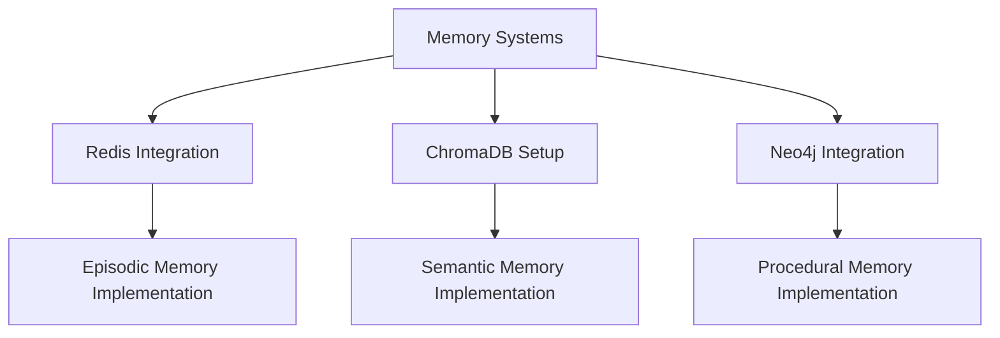
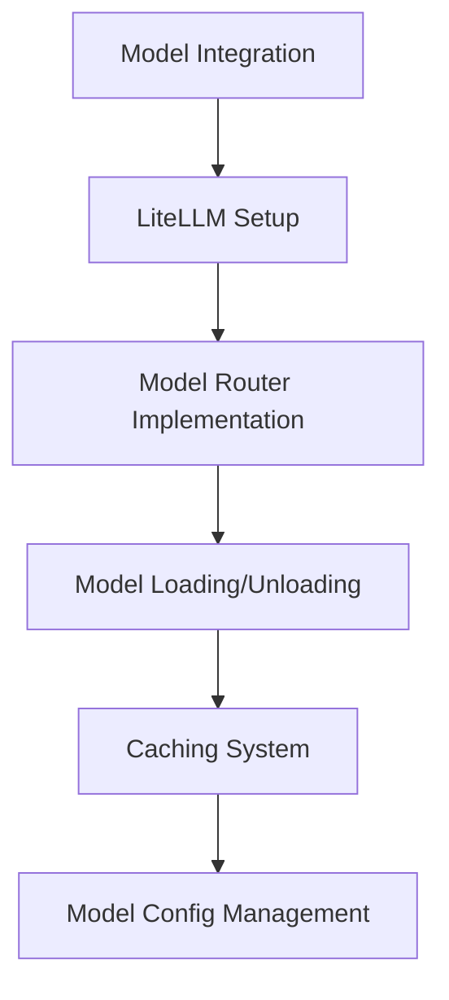
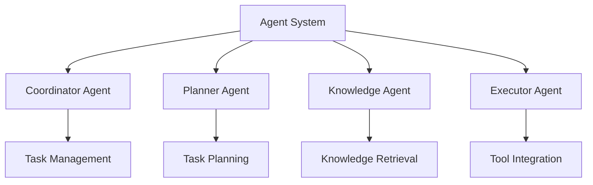

# OpenMagus Implementation Plan

## Current State Analysis
The project has a good foundation with the basic structure in place:
- Multi-agent system architecture defined
- Core components scaffolded
- Basic tools and utilities present
- Sandbox runtime API implemented

## Missing Critical Components
1. Memory Systems
   - No implementation of episodic, procedural, or semantic memory
   - Need to add Redis and ChromaDB integration
   - Graph database (Neo4j) integration missing

2. Model Integration
   - LiteLLM integration not implemented
   - Model configuration management missing
   - Caching system needed
   - Error handling and recovery systems needed

3. Agent Implementation Gaps
   - Core agent logic incomplete
   - Inter-agent communication protocol missing
   - Task state management not implemented
   - Error handling and recovery systems needed

## Implementation Plan

### Phase 1: Core Infrastructure (2-3 weeks)
1. Memory Systems


2. Model Integration with LiteLLM


### Phase 2: Agent Implementation (3-4 weeks)


### Phase 3: Tools and Integration (2-3 weeks)
1. Enhanced Tool Integration
   - Browser automation refinement
   - API connector implementation
   - Data processing pipeline
   - Deployment system setup

2. Security Implementation
   - Input sanitization
   - Request validation
   - Network security protocols

### Phase 4: Testing and Documentation (2 weeks)
1. Test Coverage
   - Unit tests for all components
   - Integration tests for agent interactions
   - End-to-end system tests
   - Performance benchmarks

2. Documentation
   - API documentation
   - System architecture docs
   - Deployment guides
   - Usage examples

## Dependencies to Add
1. Memory Systems:
   - redis-py
   - chromadb
   - neo4j-driver

2. Model Integration:
   - litellm
   - torch (or tensorflow)

3. Testing:
   - pytest
   - pytest-asyncio
   - pytest-cov

## High-Level System Architecture
```mermaid
graph TB
    User[User/Client] --> API[OpenMagus API Layer]
    
    subgraph Agents[Agent System]
        Coord[Coordinator Agent]
        Plan[Planner Agent]
        Know[Knowledge Agent]
        Exec[Executor Agent]
    end
    
    API --> Coord
    Coord --> Plan
    Coord --> Know
    Coord --> Exec
    
    subgraph Memory[Memory Systems]
        Redis[Redis - Episodic]
        Chroma[ChromaDB - Semantic]
        Neo4j[Neo4j - Procedural]
    end
    
    subgraph Models[Model Layer]
        LiteLLM[LiteLLM Router]
        Primary[Primary Model]
        Secondary[Secondary Model]
        Task[Task-Specific Models]
    end
    
    subgraph Tools[Tool Integration]
        Browser[Browser Automation]
        APIs[API Connectors]
        Data[Data Processing]
        Deploy[Deployment Systems]
    end
    
    Agents --> Memory
    Agents --> Models
    Agents --> Tools
    
    LiteLLM --> Primary
    LiteLLM --> Secondary
    LiteLLM --> Task
