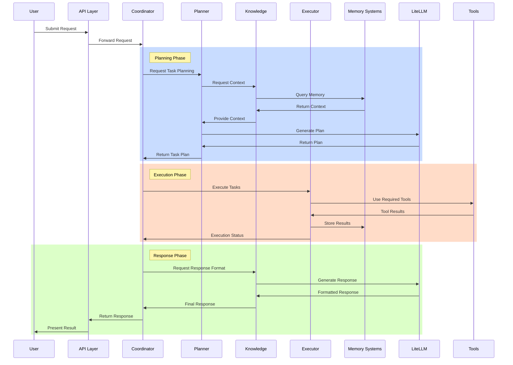
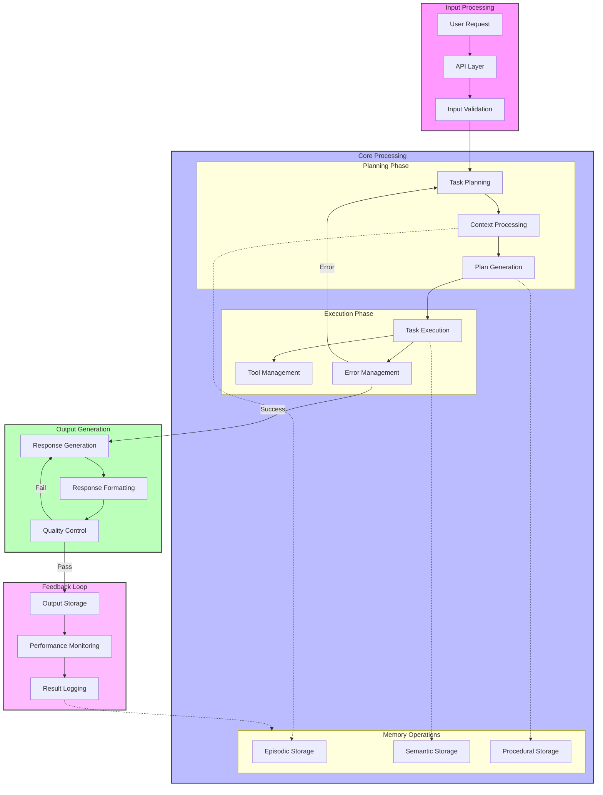
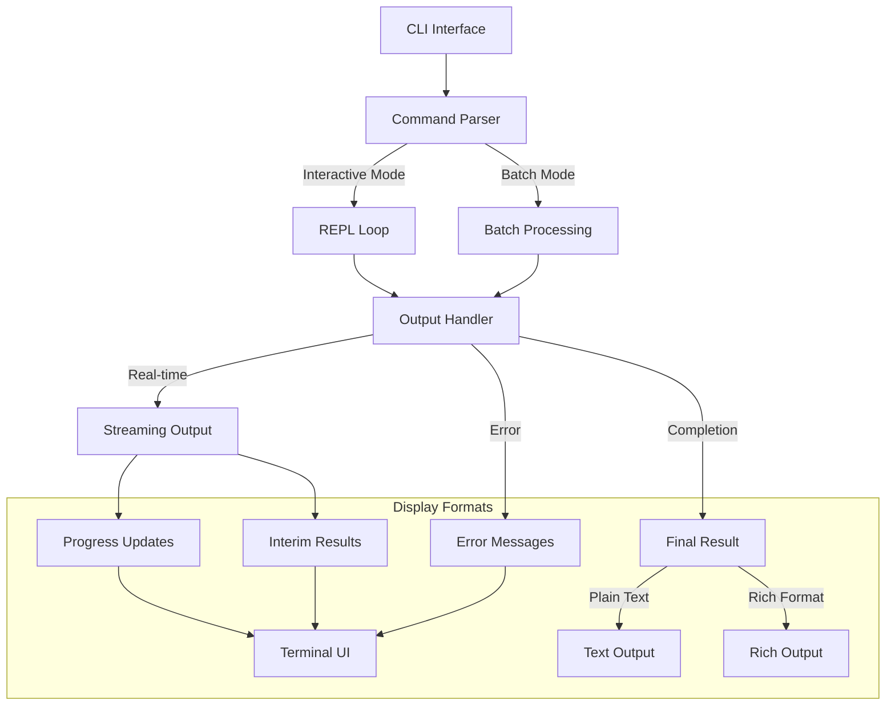
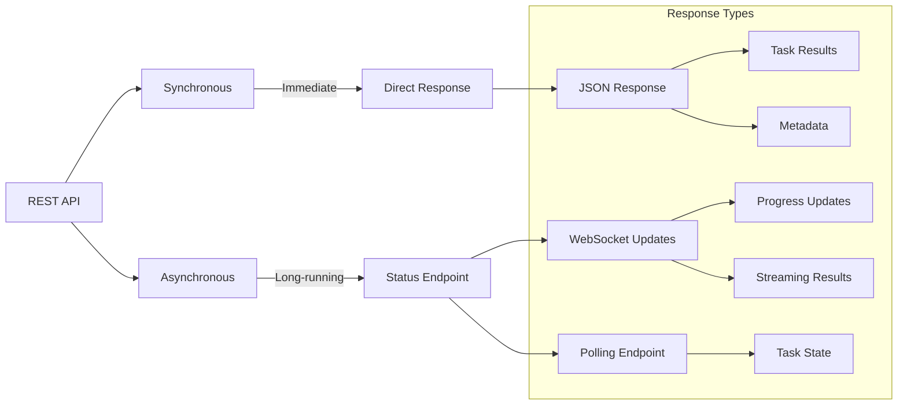
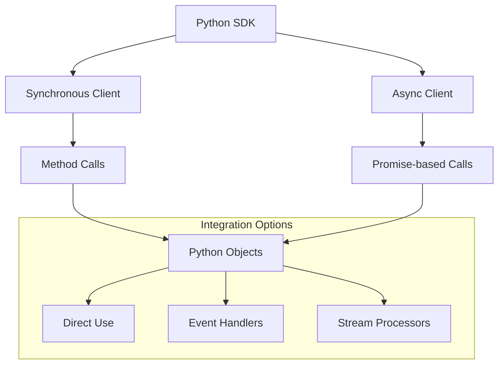
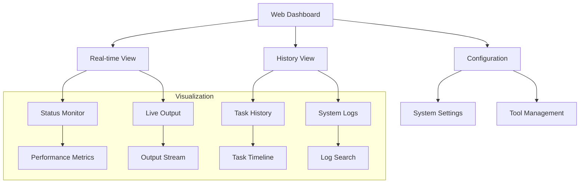

# OpenMagus Output Flow

## Request-Response Flow

## Data Flow Architecture

# User Interface & Output Methods

## 1. Command Line Interface (CLI)

### Features:
- Interactive REPL mode for step-by-step interaction
- Batch processing mode for script-based automation
- Real-time progress updates with spinners/progress bars
- Rich terminal output (colors, formatting, tables)
- Command history and auto-completion
- Error handling with detailed feedback

## 2. REST API Interface

### Features:
- RESTful endpoints for all operations
- Synchronous endpoints for quick operations
- Asynchronous endpoints for long-running tasks
- WebSocket support for real-time updates
- Structured JSON responses
- Authentication and rate limiting
- Detailed error responses with status codes

## 3. Python SDK

### Features:
- Clean, Pythonic interface
- Both synchronous and asynchronous APIs
- Type hints for better IDE support
- Event-driven programming support
- Streaming response handlers
- Automatic retries and error handling
- Comprehensive documentation

## 4. Web Dashboard

### Features:
- Real-time task monitoring
- Interactive task management
- System configuration interface
- Performance metrics visualization
- Log viewing and searching
- Tool configuration management
- User authentication and authorization

## Output Format Standards
1. **Structured Data**
   - JSON/YAML for machine consumption
   - Structured error messages
   - Metadata inclusion
   - Versioned response formats

2. **Human-Readable Output**
   - Formatted text with proper indentation
   - Color-coded output for different types
   - Progress indicators
   - Interactive elements
   - Markdown support for rich text

3. **Multi-Modal Output**
   - Text responses
   - Generated images
   - Code snippets with syntax highlighting
   - Data visualizations
   - File downloads
